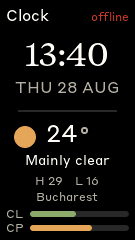
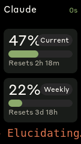
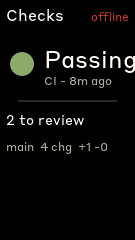
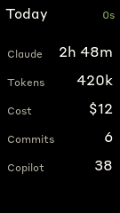
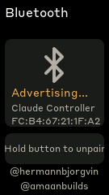

# Clawdmeter

A small ESP32 dashboard I made for my desk to keep an eye on Claude Code usage.

It runs on an **[ideaspark ESP32 1.14" ST7789](https://www.aliexpress.com/item/1005006470918484.html)** board
(135×240 IPS SPI LCD, ESP32-WROOM-32) and pairs with my laptop over Bluetooth
LE. A host daemon polls the Anthropic API for usage and pushes it to the
display. The splash screen plays pixel-art Clawd animations that get busier as
your usage rate climbs.

|                 Splash                 |                   Clock                    |               Claude usage               |
| :------------------------------------: | :----------------------------------------: | :--------------------------------------: |
|       |             |           |
| Boots here; mood follows Claude activity | Time, date, weather + usage strip; long-press for a focus timer | Session/weekly, model + context %, "safe to run?" |

|               Checks                 |                 Today                  |                Bluetooth                 |
| :----------------------------------: | :------------------------------------: | :--------------------------------------: |
|     |         |   |
| CI run, review queue, git working tree | Claude time, tokens, cost, commits    | Connection, device MAC, unpair           |

The Clawd animations come from [claudepix](https://claudepix.vercel.app),
[@amaanbuilds](https://x.com/amaanbuilds)'s library of pixel-art Clawd sprites — check it out, it's lovely.

> Earlier versions targeted the Waveshare ESP32-S3-Touch-AMOLED-2.16 (480×480,
> touch, PMU, IMU). That hardware and its three-button HID setup are gone — see
> git history. This board has **one button and no touch**.

## Hardware

- **ideaspark ESP32 1.14" ST7789** — ESP32-WROOM-32 (240 MHz, 320 KB SRAM, 4 MB flash, no PSRAM), ST7789 135×240 IPS LCD over SPI, CH340 USB-serial
- No touch, no battery/PMU, no IMU
- One usable button: **GPIO 0 (BOOT)**. GPIO 18 is the LCD clock and can't be a button.
- A USB-C (or micro-USB, depending on the batch) cable for flashing and power

Pin map lives in [`firmware/src/display_cfg.h`](firmware/src/display_cfg.h);
board notes are in [`doc/`](doc/) and [`CLAUDE.md`](CLAUDE.md).

## Screens and the button

The device boots into the splash and waits there. One button drives everything:

| Gesture                       | Action                                                                                     |
| ----------------------------- | ----------------------------------------------------------------------------------------- |
| **Short press**               | Next screen: Splash → Clock → Claude → Copilot → System → VS Code → Bluetooth → Checks → Today → Splash → … |
| **Long press** (≥ 0.7 s)      | Fresh daemon poll. On **Bluetooth**: clear the BLE bond. On **Clock**: start / stop a 25-5 focus timer. |

The **Clock** screen shows the time, date, and local weather, with a two-bar
strip along the bottom — Claude session % and Copilot premium % — so the
headline usage numbers are visible even when it isn't the usage screen. Time
and weather come from the daemon (`src:"env"`); the device keeps the clock
ticking between updates.

System and VS Code are skipped in the cycle until the daemon has sent data for
them (they need `psutil` on the host). While the splash is showing it
auto-rotates every 20 s, following the Claude-activity signal (idle / working /
needs-you) when it's available and the usage-rate group otherwise.

### Activity signal

A small dot next to the freshness pill shows what Claude Code is doing —
grey idle, terracotta working, red waiting on you. When Claude needs input
(a permission prompt, plan approval), a **"Claude needs you"** banner drops in
and the screen flashes once; any short press dismisses it. On the Claude screen,
the bottom line reads the quota verdict — **safe to run** / **cap ~1h40m** /
**cap imminent** — from the measured session burn rate.

This works out of the box from transcript activity, but installing the Claude
Code hooks makes it precise (adds the "needs you" state):

```bash
python daemon/install_hooks.py            # merges into ~/.claude/settings.json
python daemon/install_hooks.py --remove   # undo
```

The top-right of every data screen shows a freshness pill: seconds/minutes since
the last update (green → amber as it ages), or `stale` / `offline` / `waiting` /
a daemon error like `no token` when something's wrong. If the link goes quiet
the "working" animation on the Claude screen stops, so a frozen number never
looks live.

### Checks &amp; Today

**Checks** shows the latest CI run for the repo you're in (resolved from the
open VS Code / Claude Code workspace), the git working-tree state, and how many
PRs are waiting on your review — via `gh`, so run `gh auth login` once.
**Today** totals your Claude time, tokens, cost estimate, commits, and Copilot
requests since local midnight. Both are skipped in the cycle until they have data.

The Claude screen also shows the active model and context-window % (amber past
70%, red past 85% — heads-up before Claude Code auto-compacts).

### Backlight

Steady at full brightness; **breathes** gently while Claude is working (a
peripheral "still going" cue); dims to ~35% after 10 minutes with no button
press. Any press brings it back.

## Build and flash

[PlatformIO](https://docs.platformio.org/en/latest/core/installation/index.html) drives the build. On Windows the board shows up as a CH340 port (COM13 here):

```powershell
# Build
& "$env:USERPROFILE\.platformio\penv\Scripts\pio.exe" run -d firmware

# Flash (swap in your port)
& "$env:USERPROFILE\.platformio\penv\Scripts\pio.exe" run -d firmware -t upload --upload-port COM13
```

On macOS/Linux `pio run -d firmware -t upload --upload-port <port>` works the
same; the `flash.sh` / `flash-mac.sh` helpers auto-detect the port.

Hold BOOT while tapping EN if the chip doesn't enter download mode on its own
(rarely needed).

### Screenshots

`tools/screenshot.py` pulls the LVGL framebuffer over serial and writes a PNG
(pure stdlib + pyserial — no ffmpeg):

```powershell
& "$env:USERPROFILE\.platformio\penv\Scripts\python.exe" tools/screenshot.py screenshots/usage.png COM13
```

Two serial commands help here: `screen <0-6>` jumps straight to a screen
(0 = splash, 1 = clock … 6 = Bluetooth), and `feed <json>` injects a payload as if it
arrived over BLE (e.g. `feed {"s":47,"sr":138,"w":22,"wr":5400}`).
`screenshot.py --screen=N --feed='<json>'` does both before capturing.
`screenshot.sh` is the older bash + ffmpeg version.

## Host daemon

The daemon reads your Claude Code OAuth token, makes a minimal API call
(`api.anthropic.com/v1/messages`, one Haiku token — effectively free), reads the
usage numbers out of the `anthropic-ratelimit-unified-*` response headers, and
writes a JSON payload to the device over a GATT characteristic. It also tracks
the rate of change of session % and the device uses that to pick a splash
animation mood.

- **`daemon/claude_usage_daemon.py`** (macOS, Windows, and Linux via BlueZ) — also
  polls GitHub Copilot premium-request quota, host CPU/RAM/disk, VS Code process
  stats, and the time + local weather for the Clock screen. It sends a `status`
  frame when the Claude poll can't run so the device can show *why*.
- **`daemon/claude-usage-daemon.sh`** (Linux, `bluetoothctl` + `busctl`) — Claude
  usage only.

Weather uses [open-meteo](https://open-meteo.com) (no key). It defaults to
**Timișoara, Romania**; set a location in `~/.config/claude-usage-monitor/config`:

```ini
location = Berlin        # any city name — geocoded, result cached
# or pin exact coordinates (these win over `location`):
# lat = 48.85
# lon = 2.35
```

### macOS

The macOS pieces were ported by [Chris Davidson (@lorddavidson)](https://github.com/lorddavidson) — thanks Chris.

```bash
./flash-mac.sh              # auto-detects /dev/cu.usbmodem*
./install-mac.sh            # venv + LaunchAgent, first run is interactive for the BT permission prompt
```

The daemon reads the token from the Keychain (service `Claude Code-credentials`). Useful commands:

```bash
launchctl list | grep claude-usage
tail -F ~/Library/Logs/claude-usage-daemon.out.log
launchctl unload ~/Library/LaunchAgents/com.user.claude-usage-daemon.plist   # stop
launchctl load -w ~/Library/LaunchAgents/com.user.claude-usage-daemon.plist  # start
```

### Linux

```bash
cd firmware && pio run -t upload --upload-port /dev/ttyACM0
./install.sh
systemctl --user start claude-usage-daemon
```

Pair once (the MAC is on the device's Bluetooth screen):

```bash
bluetoothctl scan le                       # wait for "Claude Controller"
bluetoothctl pair   F4:12:FA:C0:8F:E5      # your MAC
bluetoothctl trust  F4:12:FA:C0:8F:E5
```

Status: `systemctl --user status claude-usage-daemon` · Logs: `journalctl --user -u claude-usage-daemon -f`

### Windows

Pair "Claude Controller" once from **Settings → Bluetooth & devices**, then run
the installer — it creates `daemon\.venv` (`bleak` + `httpx` + `psutil`) and
registers a **Scheduled Task** that starts the daemon at logon, hidden, with
restart-on-failure:

```powershell
powershell -ExecutionPolicy Bypass -File daemon\install-windows.ps1
```

```powershell
Get-ScheduledTask ClawdmeterDaemon | Get-ScheduledTaskInfo   # status
Get-Content $env:LOCALAPPDATA\claude-usage-monitor\daemon.log -Tail 20 -Wait   # logs
Stop-ScheduledTask ClawdmeterDaemon                          # stop
powershell -File daemon\install-windows.ps1 -Uninstall       # remove
```

It's a per-user Scheduled Task, not a session-0 service: `bleak`'s WinRT
Bluetooth backend only enumerates devices inside an interactive session, and the
daemon needs your `~/.claude` credentials and `gh` login. To run it in the
foreground for a quick test: `python daemon\claude_usage_daemon.py`.

## BLE protocol

The device advertises as **`Claude Controller`** with a custom GATT data service
alongside the standard HID keyboard service (`0x1812`). The HID service is only
there so desktop Bluetooth UIs surface a *Connect* button — this board sends no
keystrokes.

|                             | UUID                                   |
| --------------------------- | -------------------------------------- |
| **Data service**            | `4c41555a-4465-7669-6365-000000000001` |
| RX — host writes payloads   | `4c41555a-4465-7669-6365-000000000002` |
| TX — device ack/nack notify | `4c41555a-4465-7669-6365-000000000003` |
| REQ — device refresh request | `4c41555a-4465-7669-6365-000000000004` |

Payloads are compact JSON written to RX, routed by a `src` field (default
`claude`):

| `src`     | Fields                                                                 |
| --------- | --------------------------------------------------------------------- |
| `claude`  | `s` session %, `sr` session reset (min), `w` weekly %, `wr` weekly reset (min), `st` status, `ok`, `mdl` model short name, `ctx` context-window % |
| `copilot` | `pp` premium % used, `pr` remaining, `pe` entitlement, `prm` reset (min), `prd` reset date, `plan`, `en` |
| `sysinfo` | `cpu` %, `ct` °C, `rp` RAM %, `ru`/`rt` RAM GB, `dp` disk %, `du`/`dt` disk GB |
| `vscode`  | `mm` RSS MB, `vc` CPU %, `xe` ext-host count, `ec` error count, `le` last error |
| `env`     | `ts` unix epoch, `tz` UTC offset (min), `tp` temp °C, `tc` WMO code, `th`/`tl` today hi/lo, `tn` location |
| `act`     | `st` — `idle` / `working` / `needs_input` / `done`; `n` concurrent sessions; `age` secs |
| `ci`      | `state` `pass`/`fail`/`running`/`none`; `wf` workflow, `br` branch, `age` min; `rev`/`chg` review counts; `dty`/`ah`/`bh`/`cf` git |
| `sum`     | `am` active min, `tk` k-tokens, `usd` cost est, `cm` commits, `cp` Copilot used (today) |
| `status`  | `state` — `ok`, `no_token`, `api_error`                              |

```json
{ "s": 45, "sr": 120, "w": 28, "wr": 7200, "st": "allowed", "ok": true }
```

On boot with no data yet, the device notifies `0x01` on REQ when the daemon
subscribes, so the first payload arrives without waiting for the poll interval.

## Rebuilding fonts and icons

The `firmware/src/font_*.c` files are pre-compiled LVGL 9 bitmap fonts and
`icons.h` holds RGB565 icon arrays. Regeneration steps (lv_font_conv, the LVGL 9
patching it needs, and `tools/png_to_lvgl.js`) are documented in
[`CLAUDE.md`](CLAUDE.md) and [`tools/README.md`](tools/README.md).

## Splash animations

15 × 20×20 pixel-art animations — 13 scraped from
[claudepix.vercel.app](https://claudepix.vercel.app), 2 hand-authored Copilot
mascot loops. Pipeline:

```bash
node tools/scrape_claudepix.js   # → tools/claudepix_data/*.json
node tools/convert_to_c.js       # → firmware/src/splash_animations.h
```

Don't hand-edit `splash_animations.h` — regenerate it.

## Credits

- Pixel-art Clawd animation by [@amaanbuilds](https://x.com/amaanbuilds), sourced from [claudepix.vercel.app](https://claudepix.vercel.app).
- Original project and Waveshare build by [@hermannbjorgvin](https://github.com/hermannbjorgvin).
- macOS host port by [@lorddavidson](https://github.com/lorddavidson).
- Lucide icon set ([lucide.dev](https://lucide.dev), MIT) for the bluetooth and battery glyphs.
- Anthropic brand fonts (Tiempos Text, Styrene B) — see the licensing note below.

## Licensing gray area warning

The software in this repository uses and adheres to the Anthropic brand guidelines and uses the same proprietary fonts that Anthropic has a license for but this software uses without permission as well as using assets from Anthropic such as the copyrighted Clawd mascot so even though the code in this repo is non-proprietary I will not license it myself under a copyleft license since this repo includes proprietary fonts and copyrighted assets. Please be aware of this if you fork or copy the code from this repo. **You have been warned!**
