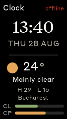
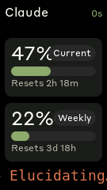
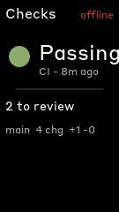
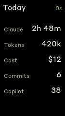
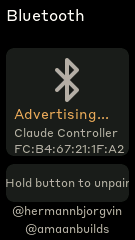

# Clawdmeter

A small ESP32 dashboard I made for my desk to keep an eye on Claude Code usage.

It runs on an **[ideaspark ESP32 1.14" ST7789](https://www.aliexpress.com/item/1005006470918484.html)** board
(135×240 IPS SPI LCD, ESP32-WROOM-32) and connects to my laptop over WiFi. A
host daemon polls the Anthropic API for usage and pushes it to the display
over HTTP. The splash screen plays pixel-art Clawd animations that get busier
as your usage rate climbs.

|                 Splash                 |                   Clock                    |               Claude usage               |
| :------------------------------------: | :----------------------------------------: | :--------------------------------------: |
|       |             |           |
| Boots here; mood follows Claude activity | Time, date, weather + usage strip; long-press for a focus timer | Session/weekly, model + context %, "safe to run?" |

|               Checks                 |                 Today                  |              Connectivity                |
| :----------------------------------: | :------------------------------------: | :--------------------------------------: |
|     |         |  |
| CI run, review queue, git working tree | Claude time, tokens, cost, commits    | WiFi IP, auth token, mDNS hostname       |

The Clawd animations come from [claudepix](https://claudepix.vercel.app),
[@amaanbuilds](https://x.com/amaanbuilds)'s library of pixel-art Clawd sprites — check it out, it's lovely.

> Earlier versions targeted the Waveshare ESP32-S3-Touch-AMOLED-2.16 (480×480,
> touch, PMU, IMU). That hardware and its three-button HID setup are gone — see
> git history. This board has **one button and no touch**.

## Hardware

- **ideaspark ESP32 1.14" ST7789** — ESP32-WROOM-32 (240 MHz, 320 KB SRAM, 4 MB flash, no PSRAM), ST7789 135×240 IPS LCD over SPI, CH340 USB-serial
- No touch, no battery/PMU, no IMU
- One usable button: **GPIO 0 (BOOT)**. GPIO 18 is the LCD clock and can't be a button.
- A USB-C (or micro-USB, depending on the batch) cable for flashing and power

Pin map lives in [`firmware/src/display_cfg.h`](firmware/src/display_cfg.h);
board notes are in [`doc/`](doc/) and [`CLAUDE.md`](CLAUDE.md).

## Screens and the button

The device boots into the splash and waits there. One button drives everything:

| Gesture                       | Action                                                                                     |
| ----------------------------- | ----------------------------------------------------------------------------------------- |
| **Short press**               | Next screen: Splash → Clock → Claude → Copilot → System → VS Code → Connectivity → Checks → Today → Splash → … |
| **Long press** (≥ 0.7 s)      | On **Connectivity**: forget the stored WiFi network. On **Clock**: start / stop a 25-5 focus timer. Elsewhere: no effect beyond the flash feedback. |

The **Clock** screen shows the time, date, and local weather, with a two-bar
strip along the bottom — Claude session % and Copilot premium % — so the
headline usage numbers are visible even when it isn't the usage screen. Time
and weather come from the daemon (`src:"env"`); the device keeps the clock
ticking between updates.

System and VS Code are skipped in the cycle until the daemon has sent data for
them (they need `psutil` on the host). While the splash is showing it
auto-rotates every 20 s, following the Claude-activity signal (idle / working /
needs-you) when it's available and the usage-rate group otherwise.

### Activity signal

A small dot next to the freshness pill shows what Claude Code is doing —
grey idle, terracotta working, red waiting on you. When Claude needs input
(a permission prompt, plan approval), a **"Claude needs you"** banner drops in
and the screen flashes once; any short press dismisses it. On the Claude screen,
the bottom line reads the quota verdict — **safe to run** / **cap ~1h40m** /
**cap imminent** — from the measured session burn rate.

This works out of the box from transcript activity, but installing the Claude
Code hooks makes it precise (adds the "needs you" state):

```bash
python daemon/install_hooks.py            # merges into ~/.claude/settings.json
python daemon/install_hooks.py --remove   # undo
```

The top-right of every data screen shows a freshness pill: seconds/minutes since
the last update (green → amber as it ages), or `stale` / `offline` / `waiting` /
a daemon error like `no token` when something's wrong. If the link goes quiet
the "working" animation on the Claude screen stops, so a frozen number never
looks live.

### Checks &amp; Today

**Checks** shows the latest CI run for the repo you're in (resolved from the
open VS Code / Claude Code workspace), the git working-tree state, and how many
PRs are waiting on your review — via `gh`, so run `gh auth login` once.
**Today** totals your Claude time, tokens, cost estimate, commits, and Copilot
requests since local midnight. Both are skipped in the cycle until they have data.

The Claude screen also shows the active model and context-window % (amber past
70%, red past 85% — heads-up before Claude Code auto-compacts).

### Backlight

Steady at full brightness; **breathes** gently while Claude is working (a
peripheral "still going" cue); dims to ~35% after 10 minutes with no button
press. Any press brings it back.

## Build and flash

[PlatformIO](https://docs.platformio.org/en/latest/core/installation/index.html) drives the build. On Windows the board shows up as a CH340 port (COM13 here):

```powershell
# Build
& "$env:USERPROFILE\.platformio\penv\Scripts\pio.exe" run -d firmware

# Flash (swap in your port)
& "$env:USERPROFILE\.platformio\penv\Scripts\pio.exe" run -d firmware -t upload --upload-port COM13
```

On macOS/Linux `pio run -d firmware -t upload --upload-port <port>` works the
same; the `flash.sh` / `flash-mac.sh` helpers auto-detect the port.

Hold BOOT while tapping EN if the chip doesn't enter download mode on its own
(rarely needed).

### Screenshots

`tools/screenshot.py` pulls the LVGL framebuffer over serial and writes a PNG
(pure stdlib + pyserial — no ffmpeg):

```powershell
& "$env:USERPROFILE\.platformio\penv\Scripts\python.exe" tools/screenshot.py screenshots/usage.png COM13
```

Two serial commands help here: `screen <n>` jumps straight to a screen index,
and `feed <json>` injects a payload as if it arrived over `POST /api/payload`
(e.g. `feed {"s":47,"sr":138,"w":22,"wr":5400}`).
`screenshot.py --screen=N --feed='<json>'` does both before capturing.
`screenshot.sh` is the older bash + ffmpeg version.

## Host daemon

The daemon reads your Claude Code OAuth token, makes a minimal API call
(`api.anthropic.com/v1/messages`, one Haiku token — effectively free), reads the
usage numbers out of the `anthropic-ratelimit-unified-*` response headers, and
POSTs a JSON payload to the device's HTTP server (found via mDNS at
`clawdmeter.local`). It also tracks the rate of change of session % and the
device uses that to pick a splash animation mood.

If the access token has expired (device shows `API error`), the daemon refreshes
it itself using the `refreshToken` in `~/.claude/.credentials.json` — writing the
rotated pair back atomically, with a one-time `.credentials.json.bak` — so usage
keeps flowing even when `claude` hasn't run in a while.

- **`daemon/claude_usage_daemon.py`** (macOS, Windows, Linux) — the canonical
  daemon. Also polls GitHub Copilot premium-request quota, host CPU/RAM/disk,
  VS Code process stats, and the time + local weather for the Clock screen. It
  sends a `status` frame when the Claude poll can't run so the device can show
  *why*.
- **`daemon/claude-usage-daemon.sh`** (Linux, `bluetoothctl` + `busctl`) — an
  older, unmaintained, BLE-only bash implementation predating the firmware's
  switch to WiFi/HTTP. Claude usage only. Left in the repo as a historical
  artifact; not the recommended daemon.

Weather uses [open-meteo](https://open-meteo.com) (no key). It defaults to
**Timișoara, Romania**; set a location in `~/.config/claude-usage-monitor/config`:

```ini
location = Berlin        # any city name — geocoded, result cached
# or pin exact coordinates (these win over `location`):
# lat = 48.85
# lon = 2.35
```

### First-time WiFi setup

There's no captive-portal/SoftAP flow — provisioning is a one-time manual step
over the USB serial connection you're already using to flash the device:

```bash
# with the device connected over serial, e.g. via a terminal at 115200 baud
feed {"src":"wifi","ssid":"your-network","pass":"your-password"}
```

Once connected, the device's **Connectivity** screen shows its IP, an
8-character auth token, and the mDNS hostname (`clawdmeter.local`). Add the
token to the daemon's config file so it can authenticate its pushes:

```ini
device_token = ABCD1234   # from the Connectivity screen
# optional override if mDNS resolution isn't available on your network:
# device_host = 192.168.1.47
```

Hold the button on the Connectivity screen to forget the stored network and
re-provision.

### macOS

The macOS pieces were ported by [Chris Davidson (@lorddavidson)](https://github.com/lorddavidson) — thanks Chris.

```bash
./flash-mac.sh              # auto-detects /dev/cu.usbmodem*
./install-mac.sh            # venv + LaunchAgent, first run is interactive for the Local Network permission prompt
```

The daemon reads the token from the Keychain (service `Claude Code-credentials`). Useful commands:

```bash
launchctl list | grep claude-usage
tail -F ~/Library/Logs/claude-usage-daemon.out.log
launchctl unload ~/Library/LaunchAgents/com.user.claude-usage-daemon.plist   # stop
launchctl load -w ~/Library/LaunchAgents/com.user.claude-usage-daemon.plist  # start
```

### Linux

```bash
cd firmware && pio run -t upload --upload-port /dev/ttyACM0
```

`./install.sh` sets up **`daemon/claude-usage-daemon.sh`**, the older BLE-only
bash daemon — see the note above, it's legacy and not the recommended path.
For the canonical Python daemon on Linux, set up a venv and point
`daemon/claude-usage-daemon.service`'s `ExecStart` at
`daemon/claude_usage_daemon.py` manually (no dedicated Linux installer script
yet — `install-windows.ps1`/`install-mac.sh` are the two that exist):

```bash
python3 -m venv daemon/.venv
daemon/.venv/bin/pip install httpx psutil
mkdir -p ~/.config/systemd/user
sed "s|DAEMON_PATH|$(pwd)/daemon/.venv/bin/python $(pwd)/daemon/claude_usage_daemon.py|g" \
    daemon/claude-usage-daemon.service > ~/.config/systemd/user/claude-usage-daemon.service
systemctl --user daemon-reload
systemctl --user enable --now claude-usage-daemon
```

Then provision WiFi and the auth token as described above (over serial, then
add `device_token` to the config file) — no Bluetooth pairing needed.

Status: `systemctl --user status claude-usage-daemon` · Logs: `journalctl --user -u claude-usage-daemon -f`

### Windows

Provision WiFi first (see above), then run the installer — it creates
`daemon\.venv` (`httpx` + `psutil`) and registers a **Scheduled Task** that
starts the daemon at logon, hidden, with restart-on-failure:

```powershell
powershell -ExecutionPolicy Bypass -File daemon\install-windows.ps1
```

```powershell
Get-ScheduledTask ClawdmeterDaemon | Get-ScheduledTaskInfo   # status
Get-Content $env:LOCALAPPDATA\claude-usage-monitor\daemon.log -Tail 20 -Wait   # logs
Stop-ScheduledTask ClawdmeterDaemon                          # stop
powershell -File daemon\install-windows.ps1 -Uninstall       # remove
```

It's a per-user Scheduled Task rather than a session-0 service — mostly
because the daemon needs your `~/.claude` credentials and `gh` login, which
live in your user session. To run it in the foreground for a quick test:
`python daemon\claude_usage_daemon.py`.

## HTTP protocol

The device runs an HTTP server on port 80, advertised via mDNS as
`clawdmeter.local`. Earlier versions used BLE — removed in favor of WiFi/HTTP
once the two turned out not to fit in this no-PSRAM board's memory budget at
the same time (see [`CLAUDE.md`](CLAUDE.md) for the full story).

| Route                     | Auth                     | Purpose                                  |
| -------------------------- | ------------------------- | ----------------------------------------- |
| `GET /`                    | open                      | Dashboard page                            |
| `GET /api/state`           | open                      | JSON mirror of everything the device holds |
| `GET /api/screenshot.bmp`  | open                      | Current LCD frame as a 24-bpp BMP         |
| `POST /api/payload`        | `X-Auth-Token` header     | The daemon's data-push path (below)       |

The device generates an 8-character auth token on first WiFi connect (shown on
the Connectivity screen); `GET /api/state` deliberately never exposes it, or
an open read route would leak the credential that's supposed to gate the one
write route.

Payloads POSTed to `/api/payload` are compact JSON, routed by a `src` field
(default `claude`) — the same shapes as before, just POSTed instead of written
to a GATT characteristic:

| `src`     | Fields                                                                 |
| --------- | --------------------------------------------------------------------- |
| `claude`  | `s` session %, `sr` session reset (min), `w` weekly %, `wr` weekly reset (min), `st` status, `ok`, `mdl` model short name, `ctx` context-window % |
| `copilot` | `pp` premium % used, `pr` remaining, `pe` entitlement, `prm` reset (min), `prd` reset date, `plan`, `en` |
| `sysinfo` | `cpu` %, `ct` °C, `rp` RAM %, `ru`/`rt` RAM GB, `dp` disk %, `du`/`dt` disk GB |
| `vscode`  | `mm` RSS MB, `vc` CPU %, `xe` ext-host count, `ec` error count, `le` last error |
| `env`     | `ts` unix epoch, `tz` UTC offset (min), `tp` temp °C, `tc` WMO code, `th`/`tl` today hi/lo, `tn` location |
| `act`     | `st` — `idle` / `working` / `needs_input` / `done`; `n` concurrent sessions; `age` secs |
| `ci`      | `state` `pass`/`fail`/`running`/`none`; `wf` workflow, `br` branch, `age` min; `rev`/`chg` review counts; `dty`/`ah`/`bh`/`cf` git |
| `sum`     | `am` active min, `tk` k-tokens, `usd` cost est, `cm` commits, `cp` Copilot used (today) |
| `status`  | `state` — `ok`, `no_token`, `api_error`                              |
| `wifi`    | `ssid`, `pass` — one-time provisioning, normally sent over serial instead (see above) |

```bash
curl -X POST http://clawdmeter.local/api/payload \
  -H "X-Auth-Token: <token from the Connectivity screen>" \
  -d '{ "s": 45, "sr": 120, "w": 28, "wr": 7200, "st": "allowed", "ok": true }'
```

## Rebuilding fonts and icons

The `firmware/src/font_*.c` files are pre-compiled LVGL 9 bitmap fonts and
`icons.h` holds RGB565 icon arrays. Regeneration steps (lv_font_conv, the LVGL 9
patching it needs, and `tools/png_to_lvgl.js`) are documented in
[`CLAUDE.md`](CLAUDE.md) and [`tools/README.md`](tools/README.md).

## Splash animations

15 × 20×20 pixel-art animations — 13 scraped from
[claudepix.vercel.app](https://claudepix.vercel.app), 2 hand-authored Copilot
mascot loops. Pipeline:

```bash
node tools/scrape_claudepix.js   # → tools/claudepix_data/*.json
node tools/convert_to_c.js       # → firmware/src/splash_animations.h
```

Don't hand-edit `splash_animations.h` — regenerate it.

## Credits

- Pixel-art Clawd animation by [@amaanbuilds](https://x.com/amaanbuilds), sourced from [claudepix.vercel.app](https://claudepix.vercel.app).
- Original project and Waveshare build by [@hermannbjorgvin](https://github.com/hermannbjorgvin).
- macOS host port by [@lorddavidson](https://github.com/lorddavidson).
- Lucide icon set ([lucide.dev](https://lucide.dev), MIT) for the battery glyph.
- Anthropic brand fonts (Tiempos Text, Styrene B) — see the licensing note below.

## Licensing gray area warning

The software in this repository uses and adheres to the Anthropic brand guidelines and uses the same proprietary fonts that Anthropic has a license for but this software uses without permission as well as using assets from Anthropic such as the copyrighted Clawd mascot so even though the code in this repo is non-proprietary I will not license it myself under a copyleft license since this repo includes proprietary fonts and copyrighted assets. Please be aware of this if you fork or copy the code from this repo. **You have been warned!**
